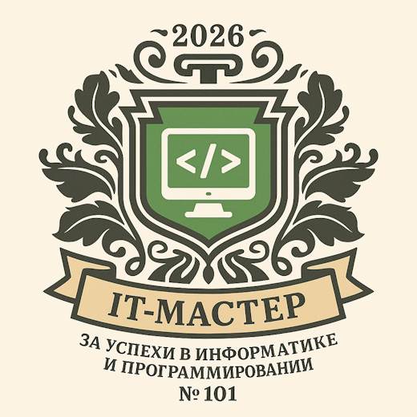

# Бейдж "IT-мастер"

## Визуальное представление


## Основная информация

**Эмитент**: МБОУ "Средняя общеобразовательная школа №1"  
**ID Эмитента**: school-001-rf-edu  
**Адрес эмитента**: school1.edu.ru  

**Платформа**: Символ  
**Адрес платформы**: gosymbol.ru  

**Класс бейджа**: Цифровые компетенции  
**Категория**: Информационные технологии  
**Уровень**: Экспертный  
**Код бейджа**: SCH-001-IT-MASTER  
**Статус**: Активный  

## Метаданные бейджа

**ID бейджа**: badge-it-master-2024  
**URL бейджа**: https://gosymbol.ru/badges/school/it-master  

## Информация о получателе

**Получатель**: [Имя учащегося]  
**Класс**: [X класс]  
**ID**: [Уникальный ID учащегося]  
**Дата получения**: [ДД.ММ.ГГГГ]  

## Критерии получения

### Технические компетенции:

#### Программирование:
1. **Базовые языки**: Знание минимум 2 языков программирования
   - Python, JavaScript, C++, Java, Scratch
2. **Проектная деятельность**: Создание минимум 3 рабочих программ
3. **Алгоритмическое мышление**: Решение задач по программированию

#### Веб-технологии:
1. **HTML/CSS**: Создание адаптивных веб-страниц
2. **JavaScript**: Интерактивные элементы
3. **Фреймворки**: Знакомство с современными инструментами

#### Системное администрирование:
1. **Операционные системы**: Уверенное владение Windows/Linux
2. **Сетевые технологии**: Понимание принципов работы сети
3. **Безопасность**: Основы информационной безопасности

### Достижения и участие:

#### Олимпиады и конкурсы:
- Участие в олимпиаде по информатике (школьный/районный уровень)
- Хакатоны и IT-соревнования
- Конкурсы по программированию

#### Проектная деятельность:
- Разработка приложений для школы
- Создание веб-сайтов
- Участие в командных IT-проектах

### Образовательные достижения:
- Оценка "5" по информатике
- Прохождение дополнительных IT-курсов
- Сертификаты от образовательных платформ

## Уровни мастерства

### Базовый IT-мастер:
- Владение 1-2 языками программирования
- Создание простых программ и сайтов
- Участие в школьных IT-проектах

### Продвинутый IT-мастер:
- Владение 3+ языками программирования
- Разработка сложных приложений
- Призовые места в районных олимпиадах

### Экспертный IT-мастер:
- Глубокие знания в нескольких областях IT
- Наставничество других учеников
- Участие в региональных/всероссийских соревнованиях

## Преимущества обладателя

### Технические привилегии:
- Доступ к дополнительному компьютерному времени
- Использование специализированного ПО
- Приоритет при записи в IT-кружки

### Образовательные возможности:
- Рекомендации в IT-вузы и колледжи
- Стажировки в IT-компаниях
- Участие в профильных сменах

### 👨‍🏫 Наставническая деятельность:
- Помощь учителям в проведении уроков
- Обучение младших школьников
- Техническая поддержка школьных мероприятий

## Технологический стек

### Языки программирования:
- **Python** - для начинающих и анализа данных
- **JavaScript** - для веб-разработки
- **C++** - для олимпиадного программирования
- **Scratch** - визуальное программирование

### Инструменты разработки:
- Visual Studio Code / PyCharm
- Git и GitHub для контроля версий
- Системы сборки и тестирования

### Веб-технологии:
- HTML5, CSS3, Bootstrap
- React.js / Vue.js
- Node.js для backend

## Проектные направления

### Веб-разработка:
- Сайты для школы и класса
- Интернет-магазины (учебные проекты)
- Портфолио и блоги

### Мобильные приложения:
- Android приложения
- Кроссплатформенная разработка
- Игры и утилиты

### Искусственный интеллект:
- Машинное обучение
- Обработка изображений
- Чат-боты

### Геймдев:
- 2D/3D игры
- Unity и Unreal Engine
- Игровая логика и дизайн

## Статистика бейджа

**Всего выдано**: 15 бейджей  
**В этом учебном году**: 6 бейджей  
**Популярный язык**: Python (60%)  
**Средний возраст получателей**: 15.8 лет  

## Связанные бейджи

- **Цифровой художник** - Креативные технологии
- **Робототехник** - Железо + софт
- **Медиа-творец** - Контент и технологии

## Карьерные перспективы

### IT-профессии:
- Программист / Разработчик
- Веб-дизайнер / Frontend-разработчик
- Системный администратор
- Специалист по кибербезопасности
- Data Scientist / Аналитик данных

### Стартап и предпринимательство:
- Создание собственных IT-продуктов
- Фриланс в сфере разработки
- IT-консалтинг

## JSON-LD метаданные

```json
{
  "@context": "https://w3id.org/openbadges/v2",
  "type": "BadgeClass",
  "id": "https://gosymbol.ru/badges/school/it-master",
  "name": "IT-мастер",
  "description": "Бейдж за выдающиеся успехи в информатике и программировании",
  "image": "https://gosymbol.ru/images/badges/it-master.png",
  "criteria": {
    "type": "Criteria",
    "narrative": "Демонстрация глубоких знаний в области информационных технологий, владение языками программирования, создание IT-проектов и участие в профильных соревнованиях"
  },
  "issuer": {
    "type": "Issuer",
    "id": "https://school1.edu.ru",
    "name": "МБОУ СОШ №1",
    "email": "badges@school1.edu.ru"
  },
  "tags": ["IT", "программирование", "информатика", "технологии", "разработка"]
}
```

## Контакты

**Ответственный за выдачу**: Учитель информатики  
**Email**: it@school1.edu.ru  
**Кабинет**: Компьютерный класс  
**Время консультаций**: Пн-Пт 14:00-16:00  

---

*Будущее принадлежит тем, кто понимает технологии и умеет их создавать*


